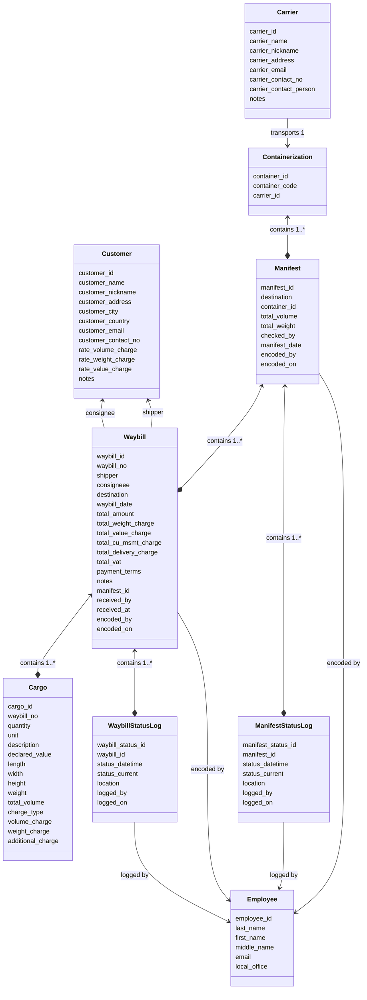

# Database Model

## Table of Contents

- [Entity Diagram](#entity-diagram)
- [Model Specifications](#model-specifications)
  - [Cargo](#cargo)
  - [Carrier](#carrier)
  - [Containerization](#containerization)
  - [Customer](#customer)
  - [Employee](#employee)
  - [Manifest](#manifest)
  - [Manifest Status Log](#manifest-status-log)
  - [Waybill](#waybill)
  - [Waybill Status Log](#waybill-status-log)

## Entity Diagram

## Model Specifications

### Cargo

- cargo_id- ID, Auto Generated
- waybill_id- ID, Foreign Key[Waybill], Required
- quantity- Integer[12], Required
- unit- String[20], Required
- description- String[100], Required
- declared_value- Decimal[11.2], Required
- length- Decimal[12.6], Optional
- width- Decimal[12.6], Optional
- height- Decimal[12.6], Optional
- weight- Decimal[10.4], Optional
- total_volume- Decimal[12.6], Optional
- charge_type- String[20], Optional
- volume_charge- Decimal[11.2], Optional
- weight_charge- Decimal[11.2], Optional
- additional_charge- Decimal[11.2], Optional

### Carrier

- carrier_id - ID, Auto Generated
- carrier_name - String[50], Required, Unique
- carrier_nickname - String[20], Optional
- carrier_address - String[100], Optional
- carrier_email - String[50], Unique, Optional
- carrier_contact_no - String[20], Optional
- carrier_contact_person - String[50], Optional
- notes - String[500], Optional

### Containerization

- container_id - ID, Auto Generated
- container_code - String[20], Required
- carrier_id - Integer[12], FK[Carrier], Required
- container_date - DateTime, Required

### Customer

- customer_id - ID, Auto Generated
- customer_name - String[50], Unique
- customer_nickname - String[20], Unique, Optional
- customer_address - String[100], Optional
- customer_city - String[50], Optional
- customer_country - String[50], Optional
- customer_email - String[50], Unique, Optional
- customer_contact_no - String[50], Optional
- rate_volume_charge - Decimal[11.2], Optional
- rate_weight_charge - Decimal[11.2], Optional
- rate_value_charge - Decimal[11.2], Optional
- notes - String[500], Optional

### Employee

- employee_id - ID, Auto Generated
- last_name - String[30], Required
- first_name - String[50], Required
- middle_name - String[30], Optional
- email - String[80], Required
- local_office - String[20], Required

### Manifest

- manifest_id - ID, Auto Generated
- manifest_no - Integer[12], Unique, Required
- destination - String[20]
- container_id - ID, Foreign Key[Containerization]
- total_volume - Decimal[12.6], Optional
- total_weight - Decimal[12,6], Optional
- checked_by - ID, Foriegn Key[Employee], Required
- manifest_date - DateTime, Required
- encoded_by - ID, Foriegn Key[Employee], Required
- encoded_on - DateTime, Required

### Manifest Status Log

- manifest_status_id - ID, Auto Generated
- manifest_id - ID, Foreign Key[Manifest], Required
- status_datetime - DateTime, Required
- status_current - String[20], Required
- location - String[50], Required
- logged_by - ID, Foreign Key[Employee], Required
- logged_on - DateTime, Required

### Waybill

- waybill_id - ID, Auto Generated
- waybill_no - Integer[12], Unique, Required
- shipper - Integer[12], Foreign Key[Customer], Required
- consigneee - Integer[12], Foreign Key[Customer], Required
- destination - String[20], Required
- destination_address - String[100], Optional
- waybill_date - DateTime, Required
- total_amount - Decimal[11.2], Required
- total_weight_charge - Decimal[11.2], Optional
- total_value_charge - Decimal[11.2], Optional
- total_cu_msmt_charge - Decimal[11.2], Optional
- total_delivery_charge - Decimal[11.2], Optional
- total_vat - Decimal[11.2], Optional
- payment_terms - String[20], Optional
- manifest_id - Integer[12], Foreign Key[Manifest], Optional
- received_by - ID, Foreign Key[Employee], Required
- received_at - String[20], Required
- encoded_by - ID, Foreign Key[Employee], Required
- encoded_on - DateTime, Required

### Waybill Status Log

- waybill_status_id - ID, Auto Generated
- waybill_id - ID, Foreign Key[Waybill], Required
- status_datetime - DateTime, Required
- status_current - String[20], Required
- location - String[50], Required
- logged_by - ID, Foreign Key[Employee], Required
- logged_on - DateTime, Required
