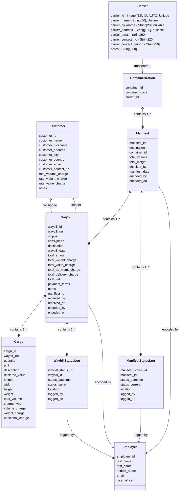

# Database Model

## Table of Contents

- [Entity Diagram](#entity-diagram)
- [Model Specifications](#model-specifications)
  - [Cargo](#cargo)
  - [Carrier](#carrier)
  - [Containerization](#containerization)
  - [Customer](#customer)
  - [Employee](#employee)
  - [Manifest](#manifest)
  - [Manifest Status Log](#manifest-status-log)
  - [Waybill](#waybill)
  - [Waybill Status Log](#waybill-status-log)

## Entity Diagram

## Model Specifications

### Cargo

- cargo_id- Integer[12], ID, AUTO, Unique
- waybill_no- Integer[12], Unique FK[Waybill]
- quantity- Integer[12]
- unit- String[20]
- description- String[100]
- declared_value- Decimal[11.2]
- length- Decimal[12.6], nullable
- width- Decimal[12.6], nullable
- height- Decimal[12.6], nullable
- weight- Decimal[10.4], nullable
- total_volume- Decimal[12.6], nullable
- charge_type- String[20], nullable May be unnecessary, basically a flag to
  determine to charge by volume, weight, or both, which can be programmatically
  determined
- volume_charge- Decimal[11.2], nullable
- weight_charge- Decimal[11.2], nullable
- additional_charge- Decimal[11.2], nullable Might need to revisit other
  possible charges and create field for each, for now can only foresee delivery
  charge

### Carrier

- carrier_id - Integer[12], ID, AUTO, Unique
- carrier_name - String[50], Unique
- carrier_nickname - String[20], nullable
- carrier_address - String[100], nullable
- carrier_email - String[50]
- carrier_contact_no - String[20]
- carrier_contact_person - String[50]
- notes - String[500]

### Containerization

- container_id - Integer[12], ID, AUTO, Unique
- container_code - String[20]
- carrier_id - Integer[12], FK[Carrier]

### Customer

- customer_id - Integer[12], ID, AUTO, Unique
- customer_name - String[50], Unique
- customer_nickname - String[20], nullable
- customer_address - String[100], nullable
- customer_city - String[50], nullable
- customer_country - String[50], nullable
- customer_email - String[50], nullable
- customer_contact_no - String[50], nullable
- rate_volume_charge - Decimal[11.2]
- rate_weight_charge - Decimal[11.2]
- rate_value_charge - Decimal[11.2]
- notes - String[500], nullable

### Employee

- employee_id - Integer[12], ID, AUTO, Unique - can be used as foreign key for
  Users to tie Employee record to User
- last_name - String[30]
- first_name - String[50]
- middle_name - String[30], nullable
- email - String[80]
- local_office - String[20]

### Manifest

- manifest_id - Integer[12], ID, AUTO, Unique
- destination - String[20] - or possibly a foreign key if creating a reference
  table for branches e.g. 'CEB' for Cebu
- container_id - Integer[12], FK[Containerization]
- total_volume - Decimal[12.6], nullable
- total_weight - Decimal[12,6], nullable
- checked_by - String[20] - or possibly foreign key pointing to Employee using
  employee_id
- manifest_date - DateTime
- encoded_by - String[20] - or possibly foreign key pointing to Employee using
  employee_id
- encoded_on - DateTime

### Manifest Status Log

- manifest_status_id - Integer[16], ID, AUTO, Unique
- manifest_id - Integer[12], FK[Manifest]
- status_datetime - DateTime
- status_current - String[20]
- location - String[50]
- logged_by - Integer[12], FK[Employee]
- logged_on - DateTime

### Waybill

- waybill_id - Integer[12], ID, AUTO, Unique
- waybill_no - Integer[12], Unique
- shipper - Integer[12], FK[Customer]
- consigneee - Integer[12], FK[Customer]
- destination - String[20]
- waybill_date - DateTime, nullable
- total_amount - Decimal[11.2]
- total_weight_charge - Decimal[11.2], nullable
- total_value_charge - Decimal[11.2], nullable
- total_cu_msmt_charge - Decimal[11.2], nullable
- total_delivery_charge - Decimal[11.2], nullable
- total_vat - Decimal[11.2], nullable
- payment_terms - String[20] - or possibly a foreign key if creating a reference
  table for Payment Terms e.g. 'ACCT' for Account or 'PPD' for Prepaid
- notes - String[500], nullable
- manifest_id - Integer[12], FK[Manifest]
- received_by - String[20] - or possibly foreign key pointing to Employee using
  employee_id
- received_at - String[20] - or possibly a foreign key if creating a reference
  table for branches e.g. 'CEB' for Cebu
- encoded_by - String[20] - or possibly foreign key pointing to Employee using
  employee_id
- encoded_on - DateTime

### Waybill Status Log

- waybill_status_id - Integer[16], ID, AUTO, Unique
- waybill_id - Integer[12], FK[Waybill]
- status_datetime - DateTime
- status_current - String[20]
- location - String[50]
- logged_by - Integer[12], FK[Employee]
- logged_on - DateTime
