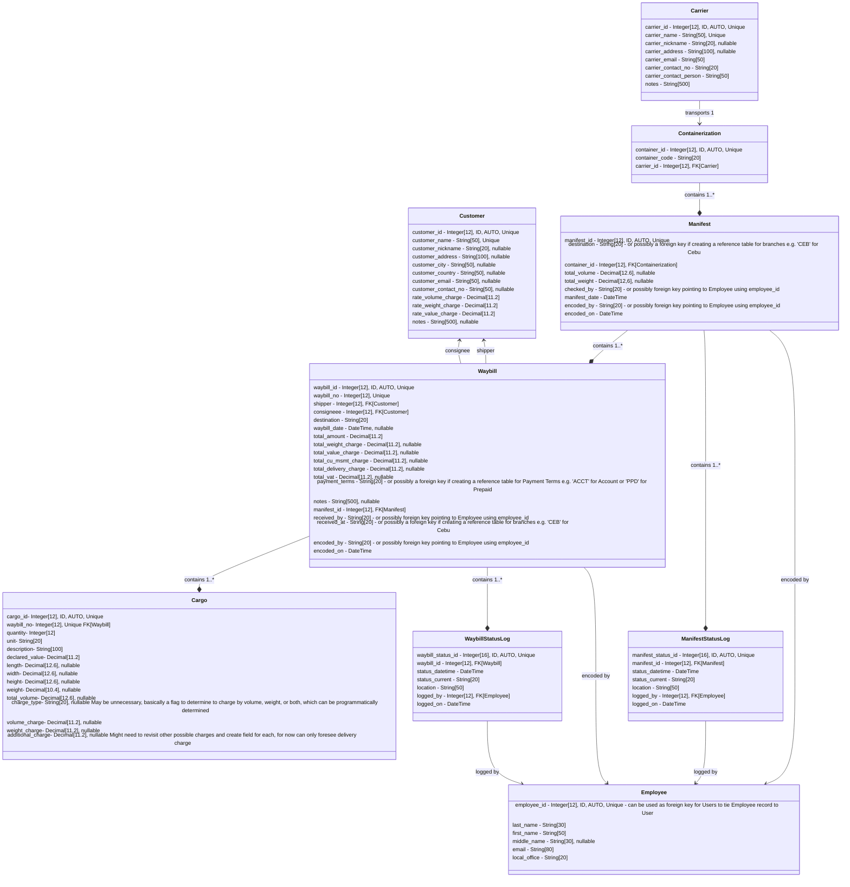

# Database Model

## Entity Diagram

```mermaid
classDiagram
class Employee{
  employee_id - Integer[12], ID, AUTO, Unique - can be used as foreign key for Users to tie Employee record to User
  last_name - String[30]
  first_name - String[50]
  middle_name - String[30], nullable
  email - String[80]
  local_office - String[20]
}
class Customer{
  customer_id - Integer[12], ID, AUTO, Unique
  customer_name - String[50], Unique
  customer_nickname - String[20], nullable
  customer_address - String[100], nullable
  customer_city - String[50], nullable
  customer_country - String[50], nullable
  customer_email - String[50], nullable
  customer_contact_no - String[50], nullable
  rate_volume_charge - Decimal[11.2]
  rate_weight_charge - Decimal[11.2]
  rate_value_charge - Decimal[11.2]
  notes - String[500], nullable
}
class Waybill{
  waybill_id - Integer[12], ID, AUTO, Unique
  waybill_no - Integer[12], Unique
  shipper - Integer[12], FK[Customer]
  consigneee - Integer[12], FK[Customer]
  destination - String[20]
  waybill_date - DateTime, nullable
  total_amount - Decimal[11.2]
  total_weight_charge - Decimal[11.2], nullable
  total_value_charge - Decimal[11.2], nullable
  total_cu_msmt_charge - Decimal[11.2], nullable
  total_delivery_charge - Decimal[11.2], nullable
  total_vat - Decimal[11.2], nullable
  payment_terms - String[20] - or possibly a foreign key if creating a reference table for Payment Terms e.g. 'ACCT' for Account or 'PPD' for Prepaid
  notes - String[500], nullable
  manifest_id - Integer[12], FK[Manifest]
  received_by - String[20] - or possibly foreign key pointing to Employee using employee_id
  received_at - String[20] - or possibly a foreign key if creating a reference table for branches e.g. 'CEB' for Cebu
  encoded_by - String[20] - or possibly foreign key pointing to Employee using employee_id
  encoded_on - DateTime
}
class Cargo{
  cargo_id- Integer[12], ID, AUTO, Unique
  waybill_no- Integer[12], Unique FK[Waybill]
  quantity- Integer[12]
  unit- String[20]
  description- String[100]
  declared_value- Decimal[11.2]
  length- Decimal[12.6], nullable
  width- Decimal[12.6], nullable
  height- Decimal[12.6], nullable
  weight- Decimal[10.4], nullable
  total_volume- Decimal[12.6], nullable
  charge_type- String[20], nullable May be unnecessary, basically a flag to determine to charge by volume, weight, or both, which can be programmatically determined
  volume_charge- Decimal[11.2], nullable
  weight_charge- Decimal[11.2], nullable
  additional_charge- Decimal[11.2], nullable Might need to revisit other possible charges and create field for each, for now can only foresee delivery charge
}
class Manifest{
  manifest_id - Integer[12], ID, AUTO, Unique
  destination - String[20] - or possibly a foreign key if creating a reference table for branches e.g. 'CEB' for Cebu
  container_id - Integer[12], FK[Containerization]
  total_volume - Decimal[12.6], nullable
  total_weight - Decimal[12,6], nullable
  checked_by - String[20] - or possibly foreign key pointing to Employee using employee_id
  manifest_date - DateTime
  encoded_by - String[20] - or possibly foreign key pointing to Employee using employee_id
  encoded_on - DateTime
}
class Containerization{
  container_id - Integer[12], ID, AUTO, Unique
  container_code - String[20]
  carrier_id - Integer[12], FK[Carrier]
}
class Carrier{
  carrier_id - Integer[12], ID, AUTO, Unique
  carrier_name - String[50], Unique
  carrier_nickname - String[20], nullable
  carrier_address - String[100], nullable
  carrier_email - String[50]
  carrier_contact_no - String[20]
  carrier_contact_person - String[50]
  notes - String[500]
}
class WaybillStatusLog{
  waybill_status_id - Integer[16], ID, AUTO, Unique
  waybill_id - Integer[12], FK[Waybill]
  status_datetime - DateTime
  status_current - String[20]
  location - String[50]
  logged_by - Integer[12], FK[Employee]
  logged_on - DateTime
}
class ManifestStatusLog{
  manifest_status_id - Integer[16], ID, AUTO, Unique
  manifest_id - Integer[12], FK[Manifest]
  status_datetime - DateTime
  status_current - String[20]
  location - String[50]
  logged_by - Integer[12], FK[Employee]
  logged_on - DateTime
}
Waybill --> Employee : encoded by
Manifest --> Employee : encoded by
WaybillStatusLog --> Employee : logged by
ManifestStatusLog --> Employee : logged by
Carrier --> Containerization : transports 1
Containerization --* Manifest : contains 1..*
Manifest --* ManifestStatusLog : contains 1..*
Manifest --* Waybill : contains 1..*
Waybill --* WaybillStatusLog : contains 1..*
Waybill --* Cargo : contains 1..*
Customer <-- Waybill : shipper
Customer <-- Waybill : consignee
```
